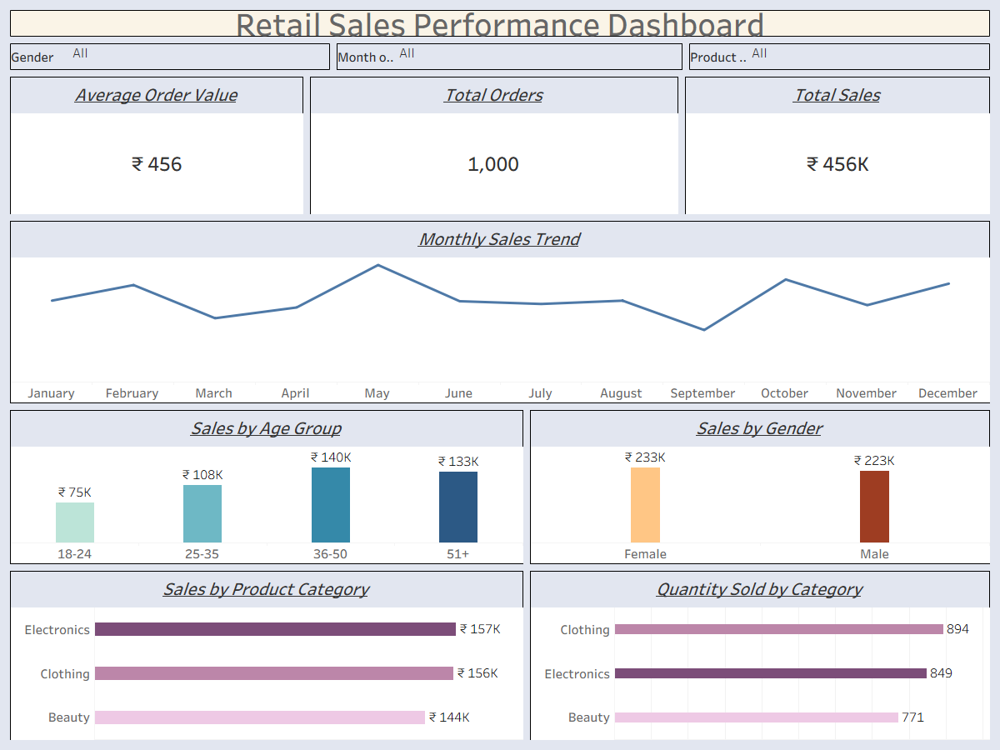

# Retail Sales Performance Analysis
## Project Overview
This project analyzes retail sales data using Excel, SQL Server, and Tableau. The objective was to identify sales trends, customer purchasing behavior, and product performance by performing SQL analysis and building an interactive Tableau dashboard.

---

## Dataset
The dataset contains 1,000 retail transactions with the following fields:
- Transaction ID
- Customer ID
- Product Category
- Gender
- Age
- Quantity
- Price Per Unit
- Total Amount
- Date

---

## Tools Used
- **Excel** – Data cleaning and preparation
- **SQL Server** – Data analysis using aggregate functions, CASE statements, CTEs, and window functions
- **Tableau** – Interactive dashboard and data visualization

---

##  Dashboard KPIs
- Total Sales
- Total Orders
- Average Order Value (AOV)

---

## SQL Analysis Performed
- Displayed sample records
- Total sales by product category
- Sales analysis by age group
- Monthly sales trend
- Top 10 customers by total sales
- One-time customer analysis using CTE
- Average Order Value (AOV)
- Cumulative revenue using window functions

---

## Dashboard Visualizations
- Monthly Sales Trend
- Sales by Age Group
- Sales by Gender
- Sales by Product Category
- Quantity Sold by Category
- KPI Cards (Total Sales, Total Orders, Average Order Value)

---

## Key Business Insights
- Electronics generated the highest sales revenue.
- Customers aged 36–50 contributed the highest sales.
- Sales peaked in May, while September recorded the lowest sales.
- Male and female customers contributed almost equally to total sales.
- The Average Order Value (AOV) was ₹456.

---

##  Project Files
- Retail_Sales_SQL_Queries.sql
- Retail_Sales_Performance_Dashboard.twbx
- Retail_Sales_Dashboard.png
- Retail_Sales_Dataset.csv

## 📷 Dashboard Preview

